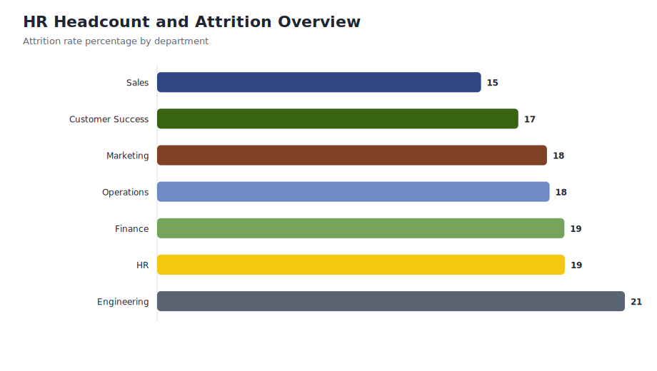
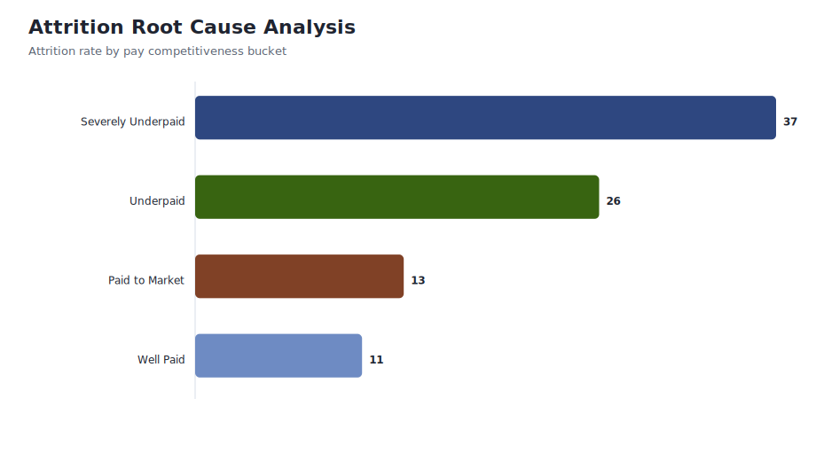

# Corporate HR People Analytics and Retention Dashboard

    
    
    
    

    ## About This Project

    This project analyzes synthetic HR, compensation, and exit-survey data to identify attrition patterns and compensation-related retention risk.

    ## Business Problem

    HR leadership needs a reliable view of headcount, voluntary exits, tenure, salary competitiveness, and employee satisfaction. The goal is to identify where attrition risk is concentrated and what actions could improve retention.

    ## Dashboard Preview

    

    

    ## Data Assets

    | File | Purpose |
    |---|---|
    | `data/employees.csv` | Synthetic employee master table. |
    | `data/salaries.csv` | Salary and market benchmark table. |
    | `data/exit_surveys.csv` | Survey scores and exit reasons. |
    | `data/department_attrition_summary.csv` | Department-level headcount and attrition KPIs. |
    | `data/compensation_risk_summary.csv` | Attrition and satisfaction by pay competitiveness bucket. |
    | `docs/data_dictionary.md` | Field definitions for HR datasets. |
    | `docs/data_quality_report.md` | Validation summary. |

    ## Key Metrics From Current Data

    | KPI | Value |
    |---|---:|
    | Employees | 1,200 |
| Departments | 7 |
| Overall attrition rate | 18.50% |
| Average tenure | 3.7 years |
| Highest attrition department | Engineering |
| Nulls in generated datasets | 0 |

    ## Technical Workflow

    1. Generate synthetic HR source tables in `hr_people_analytics_pipeline.py`.
    2. Build employee, salary benchmark, and exit survey datasets.
    3. Calculate department-level attrition and tenure metrics.
    4. Analyze compensation competitiveness and satisfaction patterns.
    5. Use `sql/analytical_queries.sql` for SQL-based attrition, salary, and survey analysis.
    6. Use `powerbi/dashboard_spec.md` and `powerbi/measures.dax` to build the Power BI report.

    ## How To Run

    ```bash
    python -m pip install -r requirements.txt
    python hr_people_analytics_pipeline.py
    ```

    ## Repository Structure

    ```text
    data/        Employee, salary, survey, and KPI summary CSV files
    docs/        Data dictionary and data quality report
    images/      Dashboard preview charts generated from the data
    powerbi/     Dashboard specification, DAX measures, and theme JSON
    sql/         Analytical SQL queries
    ```

    ## Interview Talking Points

    - Shows HR KPI modeling for attrition and retention risk.
    - Combines employee master data, salary benchmarks, and survey feedback.
    - Demonstrates SQL and Python analysis around compensation and workforce planning.
    - Best used as a supporting project for HR analytics or people analytics roles.
## Project Overview

HR People Analytics project built as a recruiter-ready analytics case study with reproducible data, SQL, Python, dashboards, reports, and business recommendations.

## Dataset Information

Data is organized into `data/raw` and `data/processed` so reviewers can distinguish source-like inputs from analysis-ready outputs.

## Tech Stack

Python, pandas, SQL, Excel/BI planning, dashboard documentation, Git, and GitHub.

## Architecture Diagram

See `docs/` and dashboard documentation for the data flow, modeling approach, and reporting layers.

## Project Workflow

1. Generate or collect source-like data.
2. Validate and clean the dataset.
3. Build processed analytical tables.
4. Analyze KPIs with SQL and Python.
5. Create dashboard and reporting assets.
6. Convert insights into recommendations.

## KPIs

- Total Employees
- Attrition Rate
- Average Tenure
- Salary Deviation
- Satisfaction

## Methodology

The analysis uses data quality checks, KPI aggregation, segment analysis, trend analysis, and business recommendation framing.

## Visualizations

Dashboard previews and chart assets are stored in `images/`.

## Dashboard Screenshots

Dashboard documentation and walkthrough files are stored in `dashboards/`.

## Key Insights

- The project identifies performance patterns across the most important business dimensions.
- Processed datasets make the analysis reproducible.
- The dashboard flow supports executive review and analyst drill-down.

## Business Recommendations

- Review the weakest segment first for short-term improvement.
- Use the strongest segment as a performance benchmark.
- Track the core KPI set weekly.

## Folder Structure

```text
data/raw
data/processed
notebooks
sql
dashboards
reports
images
src
docs
```

## Results

The repository now meets a standardized recruiter-ready analytics portfolio structure.

## Future Enhancements

- Add live BI platform files when Power BI Desktop or Tableau is available.
- Add automated CI checks for data quality.
- Add forecasting models where historical signal supports it.

## Author

Ravikant Yadav - Data Analyst Portfolio
